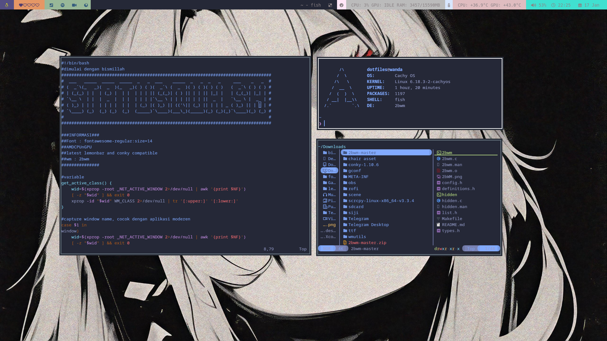
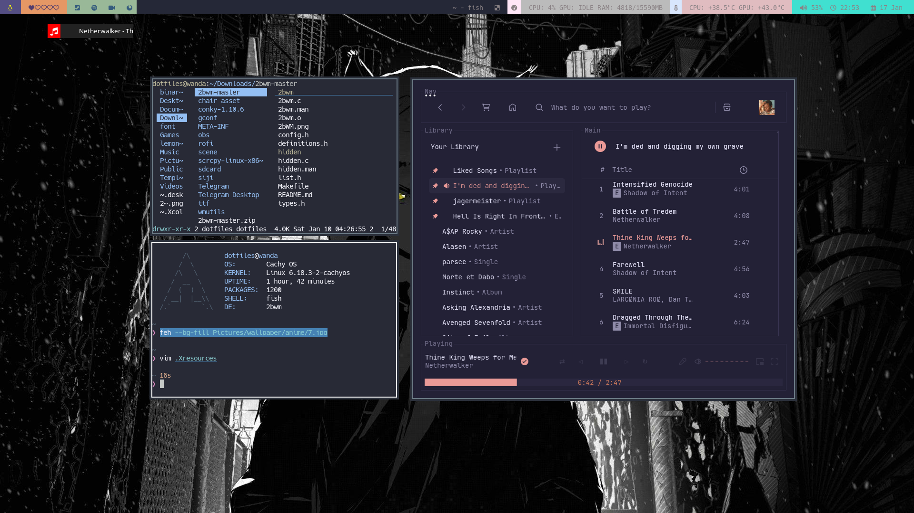

# dotfilequh

My personal Linux ricing setup ✨  

---

## 🖼 Preview



---

## 🧩 Setup Info

- **WM**        : 2bwm  
- **Bar**       : lemonbar / dzen2  
- **Status**    : conky  
- **Shell**     : fish  
- **Launcher** : custom scripts  

---

## 📦 Requirements

Before using this setup, make sure you have installed the following dependencies.

### 🔧 Core Tools
- **mkb**  
  ```bash
  git clone git://git.2f30.org/mkb
- **skroll**
  ```bash
  git clone git://z3bra.org/skroll.git
- **conky**
  ```bash
  https://github.com/brndnmtthws/conky
- **lemobar**
  ```bash
  https://aur.archlinux.org/packages/lemonbar-xft-git
- **dzen2**
  ```bash
  https://aur.archlinux.org/packages/dzen2-git
- **fonts**
  ```bash
  Siji git clone https://github.com/stark/siji && cd siji
  Font Awesome https://archlinux.org/packages/extra/any/woff2-font-awesome/
  Hack https://github.com/source-foundry/Hack
- **media popup**
  ```bash
  playerctl

## created with ❤️
  
